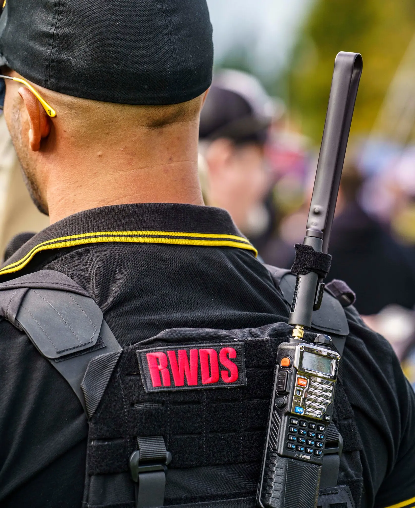

	

[[figure out the quotes thing]]
The idea of "latin" or "latino" has always rubbed me the wrong way. (Don't get me started on "LatinX"[link to latinx article]).

I feel uniquely PR and Cuban.
At the same time, I also feel a certain solidarity with, say, Nicaraguans or Uruguayans

In an interesting NYTimes <a href="https://www.nytimes.com/2023/05/12/opinion/allen-texas-shooting.html" target="_blank">piece following the recent mass shooting in Texas,</a>.Dr. Cecilia Marquez says the following:

> Agents of white supremacy can come in more than one shade, creating an increasingly multiracial coalition.

that unfortunate trope that everyone's grandma is a little racist. We are all a little bit racist, I've met people who dismissed me when they thought I was white, but then buy me a drinkk when I'm José.

> ..being white and being Latino are not mutually exclusive. It’s true, though, that the question of whether we should consider Latino as a race or as an ethnicity remains hotly debated.

Am I a race? a color? a language? some other?
> For some, the use of Latino as a racial category — which consolidates enormous racial diversity under an imagined “mestizo” (racially mixed) Latino identity — comes at the expense of representation for Black Latinos and Indigenous people. In consolidating, critics argue, it erases. For others, decades of transformative Latino social movements suggest that the shared experiences of discrimination bound together a diverse community in struggle, and still can today.

[[Words and labels fail us here. Why?]]
I'm not sure I care either way. I think the labels are part of the problem.
Sometime People are suprised to hear I'm from PR
Puerto Ricans come in different shades
I can't speak for all people from a "latin" country.

As much as I wish it were different, it turns out "latins" can racists and intolerant and some can't even (!No, papi!) dance.
Jeb Bush has a mexican wife and speaks excellent spanish. Beto O'Rourke speaks the language better than most. Somehow they are generally considered pretty white.
Ted Cruz, Nick Fuentes, Fidel Castro? Latino.

I think some people are just assholes.

