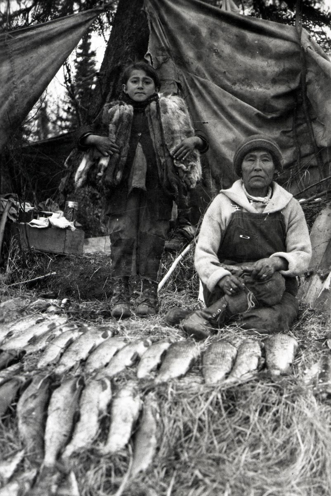

	

Emily and Christoph Nicolson of the Iliamna Fish Co live in Brooklyn (like me) for about 10 months a year. This is a picture of her great-grandmother Mary.

They spend the other two months of the year in Alaska catching wild Sockeye Salmon. We purchase and eat roughly 12 pounds of this amazing sustainably caught salmon all year long. I highly recommend them.

They still have a few limited shares for the 2023 season.
My friend Yuna(instaname) recommended this to me during the pandemic and we love it.

Check it out: <a href="https://www.redsalmon.com" alt="Iliamna Fish Co." />Iliamna Fish Co.</a>
